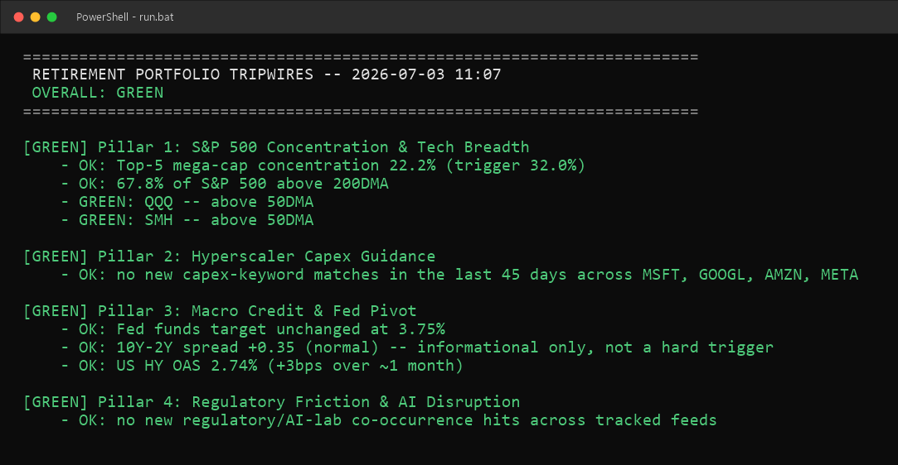

# Retirement Portfolio Tripwires

[](https://github.com/pwyller-creator/retirement-tripwires)
[](https://github.com/pwyller-creator/retirement-tripwires/actions/workflows/ci.yml)
[](https://github.com/pwyller-creator/retirement-tripwires/commits/master)
[](LICENSE)

Local macro/tech-risk tripwire monitor. Four pillars, traffic-light output,
Windows toast notification on Yellow/Red, log file + trend CSV per run.



## What it actually checks

| Pillar | Source | Notes |
|---|---|---|
| 1. S&P 500 concentration + breadth | yfinance (full 500-ticker scan, weekly) + Wikipedia constituent list | Concentration > 32%, breadth < 50% above 200DMA, or QQQ/SMH high-volume 50DMA breakdown |
| 2. Hyperscaler capex guidance | SEC EDGAR full-text search (free, no key) | Scans 8-K/10-Q/10-K filings for capex keywords. **Surfaces candidates only** — no free source gives earnings-call transcript text, so this can't judge "downward revision" on its own. Always flags YELLOW for you to read, never auto-RED. |
| 3. Fed pivot + credit spreads | FRED API | Flags an off-schedule Fed funds target change (vs. the 8 known 2026 FOMC dates) as RED; HY OAS credit spread widening >50bps/month as RED; 10Y-2Y spread shown as context only |
| 4. Regulatory/AI friction | RSS: TechCrunch, Ars Technica, FTC, DOJ Antitrust Division | Flags headlines that mention a regulatory-action term *and* a major AI lab together |

## One-time setup

```
run.bat
```
First run creates a `.venv`, installs dependencies, and executes. Subsequent
runs reuse the venv. Takes several minutes the very first time because
Pillar 1 pulls a full S&P 500 scan (~500 tickers via yfinance, chunked with
pauses to avoid rate-limiting). After that first scan, it's cached for 7
days, so daily runs are fast (just QQQ/SMH + the other 3 pillars).

`config.ini` already has your FRED key filled in (it's gitignored, not
committed). If you're setting this up on a new machine or from a fresh
clone, copy `config.ini.example` to `config.ini` and fill in a free FRED
key first — get one at fred.stlouisfed.org/docs/api/api_key.html. The
`[sec] user_agent` value is a placeholder SEC's fair-access policy requires
on every request —
it doesn't need to be a real/verified address, but you can personalize it.

## Running it daily (Windows Task Scheduler)

1. Open Task Scheduler → Create Basic Task
2. Trigger: Daily, pick a time (markets closed, e.g. 6:00 PM ET works well
   so the day's closes are final)
3. Action: **Start a program**
   - Program: `C:\Users\tdcot\OneDrive\Desktop\Webpage\retirement-tripwires\run.bat`
   - Start in: `C:\Users\tdcot\OneDrive\Desktop\Webpage\retirement-tripwires`
4. Finish. Task Scheduler will now run it unattended; a Windows toast fires
   automatically if anything's Yellow/Red.

Manual run any time: double-click `run.bat`, or `run.bat --force-weekly-scan`
to force a fresh full S&P 500 scan instead of using the cached one.

## Output

- Terminal: full traffic-light summary each run
- `logs/tripwires_YYYY-MM-DD.log`: same summary, appended, one file per day
- `logs/history.csv`: one row per run (timestamp, overall status, per-pillar
  status) — good for eyeballing trend over weeks/months
- Windows toast notification: only fires if overall status is Yellow or Red

## Known limitations (by design, given free-tier constraints)

- **Pillar 1 breadth/concentration** only refreshes weekly (yfinance free
  tier throttles a 500-ticker daily pull). QQQ/SMH breakdown check still
  runs every day.
- **Pillar 2** can only match keywords in official SEC filings, not analyst
  calls — treat every YELLOW hit as "go read this filing," not as a
  confirmed guidance cut.
- **Pillar 3**'s "unscheduled Fed move" detector uses a hardcoded list of
  2026 FOMC meeting dates (`FOMC_2026_DATES` in `pillar3_macro.py`). **Update
  that list every January** or this check silently stops being meaningful
  for future years.
- **Pillar 4**'s FTC/DOJ RSS URLs are government endpoints that
  occasionally move (both also 403 any request without a browser-like
  User-Agent, which the script already sets). If a run's output shows
  `WARN: unreachable/empty feed(s)`, check the current feed URL on
  ftc.gov/justice.gov and update `FEEDS` in `pillar4_regulatory.py`. The
  DOJ feed is scoped to the Antitrust Division specifically (component 376)
  rather than all DOJ press releases, since that's the relevant division
  for this project's trigger.
- All four pillars catch their own exceptions — if a data source is down or
  changes format, that pillar reports a WARN and the rest of the run still
  completes.

## Files

- `main.py` — orchestrator, entry point
- `pillar1_concentration.py` / `pillar2_capex.py` / `pillar3_macro.py` /
  `pillar4_regulatory.py` — one module per pillar
- `config.py`, `config.ini` — settings + your FRED key (not committed to
  git — see `.gitignore`)
- `state.py`, `data/state/*.json` — local memory between runs (dedup,
  cached scans, last-known values)
- `report.py` — builds the terminal/log/CSV output
- `notify.py` — Windows toast wrapper (via `winotify`)
