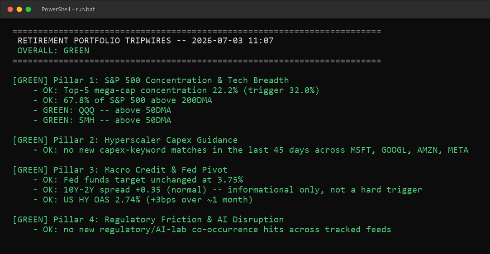

# Retirement Portfolio Tripwires

[](https://github.com/pwyller-creator/retirement-tripwires)
[](https://github.com/pwyller-creator/retirement-tripwires/actions/workflows/ci.yml)
[](https://github.com/pwyller-creator/retirement-tripwires/commits/master)
[](LICENSE)
[](https://github.com/pwyller-creator/retirement-tripwires/issues)
[](https://github.com/pwyller-creator/retirement-tripwires/pulls)

Local macro/tech-risk tripwire monitor. Four pillars, traffic-light output
(GREEN / YELLOW / RED, plus UNKNOWN when a data source failed and a pillar
couldn't check its triggers), Windows toast notification on Yellow/Red/Unknown,
log file + trend CSV per run, and a heartbeat file so a missed run is visible.



## What it actually checks

| Pillar | Source | Notes |
|---|---|---|
| 1. S&P 500 concentration + breadth | yfinance (full 500-ticker scan, weekly) + Wikipedia constituent list | Concentration > 32%, breadth < 50% above 200DMA (RED); QQQ/SMH high-volume 50DMA breakdown (RED); equal-weight vs cap-weight (RSP vs SPY) down more than 4% over ~40 trading days (YELLOW) |
| 2. Hyperscaler capex | SEC EDGAR (free, no key): submissions feed, XBRL company concepts, full-text search | Flags each new earnings release (8-K Item 2.02) for reading; flags a sharp slowdown in year-over-year capex purchases from reported XBRL numbers; keyword search of 8-K/10-Q/10-K filings. **Surfaces candidates only** — no free source gives earnings-call transcript text, so this can't judge a guidance change on its own. Always YELLOW for you to read, never RED. |
| 3. Fed pivot + macro credit | FRED API | RED: off-schedule Fed funds change, or HY OAS widening >50bps in ~1 month, or Sahm rule (unemployment up 0.5pt on its 12-month low). YELLOW: HY OAS widening >75bps in ~3 months, initial claims 4-week average >25% above its 52-week low, Chicago Fed NFCI above 0, or the 10Y-2Y curve re-steepening to positive after an inversion within the last year. 10Y-2Y level shown as context. |
| 4. Regulatory/AI friction | RSS: TechCrunch, Ars Technica, FTC, DOJ Antitrust Division | Flags headlines that mention a regulatory-action term *and* a major AI lab together. **Context only:** can raise YELLOW, never RED on its own, since keyword matches are noisy. |

**Status meanings.** GREEN = every check ran and nothing fired. YELLOW = a
candidate to read. RED = a trigger fired. UNKNOWN = a data source failed or a
check could not run, so the pillar did not look at its triggers. UNKNOWN is
never shown as GREEN, and counts as YELLOW for the overall status.

## Prerequisites

- Windows (Task Scheduler for unattended runs, `winotify` for toast alerts —
  this tool doesn't run on Mac/Linux)
- Python 3.9+ installed and on your PATH
- Internet access (yfinance, SEC EDGAR, FRED API, RSS feeds)

## Getting the code

```
git clone https://github.com/pwyller-creator/retirement-tripwires.git
cd retirement-tripwires
```

## One-time setup

Get a free FRED key at fred.stlouisfed.org/docs/api/api_key.html. Save the
key, alone on one line, to `%LOCALAPPDATA%\fallout76er-tools\fred-api-key.txt`
(the folder is outside any synced folder, so the key doesn't sync). That file
is read first. As a fallback, you can instead put it in `config.ini` under
`[fred] api_key`. Copy `config.ini.example` to `config.ini` for the rest of the
settings. The `[sec] user_agent` value is a placeholder SEC's fair-access
policy requires on every request — it doesn't need to be a real/verified
address, but you can personalize it. `config.ini` and the key file both stay
local.

```
run.bat
```
First run creates a `.venv`, installs dependencies, and executes. Subsequent
runs reuse the venv. Takes several minutes the very first time because
Pillar 1 pulls a full S&P 500 scan (~500 tickers via yfinance, chunked with
pauses to avoid rate-limiting). After that first scan, it's cached for 7
days, so daily runs are fast (QQQ/SMH and RSP/SPY, plus the other 3 pillars).

## Running it daily (Windows Task Scheduler)

1. Open Task Scheduler → Create Basic Task
2. Trigger: Daily, pick a time (markets closed, e.g. 6:00 PM ET works well
   so the day's closes are final)
3. Action: **Start a program**
   - Program: `<path-to-your-cloned-repo>\run.bat`
   - Start in: `<path-to-your-cloned-repo>`
4. Finish. Task Scheduler will now run it unattended; a Windows toast fires
   automatically if anything's Yellow/Red.

Manual run any time: double-click `run.bat`, or `run.bat --force-weekly-scan`
to force a fresh full S&P 500 scan instead of using the cached one.

## Output

- Terminal: full traffic-light summary each run
- `logs/tripwires_YYYY-MM-DD.log`: same summary, appended, one file per day
- `logs/history.csv`: one row per run (timestamp, overall status, per-pillar
  status) — good for eyeballing trend over weeks/months
- Windows toast notification: fires if overall status is Yellow or Red, or if
  any pillar is UNKNOWN (data gaps)
- `data/state/heartbeat.json`: written at the end of every run with the
  finish time and per-pillar status. A stale timestamp means the run didn't
  happen. Nothing alerts on this automatically yet.

## Backtest

`python backtest.py` replays the macro and breadth signals against S&P 500
drawdowns of 15% or more since 1990 and writes `logs/backtest_report.txt`:
how many episodes each signal caught, the median lead time, and false alarms.
Read its caveats first: FRED data is revised, publication lags aren't modeled,
and there are only about 8 episodes. Don't tune thresholds to them.

## Known limitations (by design, given free-tier constraints)

- **Pillar 1 breadth/concentration** only refreshes weekly (yfinance free
  tier throttles a 500-ticker daily pull). QQQ/SMH breakdown check still
  runs every day.
- **Pillar 2** can only match keywords in official SEC filings, not analyst
  calls — treat every YELLOW hit as "go read this filing," not as a
  confirmed guidance cut.
- **Pillar 3**'s "unscheduled Fed move" detector uses a hardcoded list of
  FOMC meeting dates (`FOMC_DATES` in `pillar3_macro.py`). **Update that list
  every January.** Until you do, the pillar reports UNKNOWN for the new year
  rather than passing silently.
- **Thresholds are heuristics.** The triggers in pillars 1–3 haven't been
  validated against history beyond the small backtest above.
- **Task Scheduler doesn't run a missed start by default.** Turn on "Run task
  as soon as possible after a scheduled start is missed" in the task's
  Settings tab, or a day with the PC off gets no run.
- **Pillar 4**'s FTC/DOJ RSS URLs are government endpoints that
  occasionally move (both also 403 any request without a browser-like
  User-Agent, which the script already sets). If a run's output shows
  `WARN: unreachable/empty feed(s)`, check the current feed URL on
  ftc.gov/justice.gov and update `FEEDS` in `pillar4_regulatory.py`. The
  DOJ feed is scoped to the Antitrust Division specifically (component 376)
  rather than all DOJ press releases, since that's the relevant division
  for this project's trigger.
- All four pillars catch their own exceptions. If a data source is down or
  changes format, that pillar reports UNKNOWN with a WARN, and the rest of the
  run still completes.

## Files

- `main.py` — orchestrator, entry point
- `pillar1_concentration.py` / `pillar2_capex.py` / `pillar3_macro.py` /
  `pillar4_regulatory.py` — one module per pillar
- `config.py`, `config.ini` — settings; the FRED key is read from the key file
  above, or `config.ini` as a fallback (neither is committed — see `.gitignore`)
- `state.py`, `data/state/*.json` — local memory between runs (dedup,
  cached scans, last-known values, heartbeat)
- `report.py` — builds the terminal/log/CSV output
- `notify.py` — Windows toast wrapper (via `winotify`)
- `backtest.py` — replays the triggers against past drawdowns (see Backtest)
